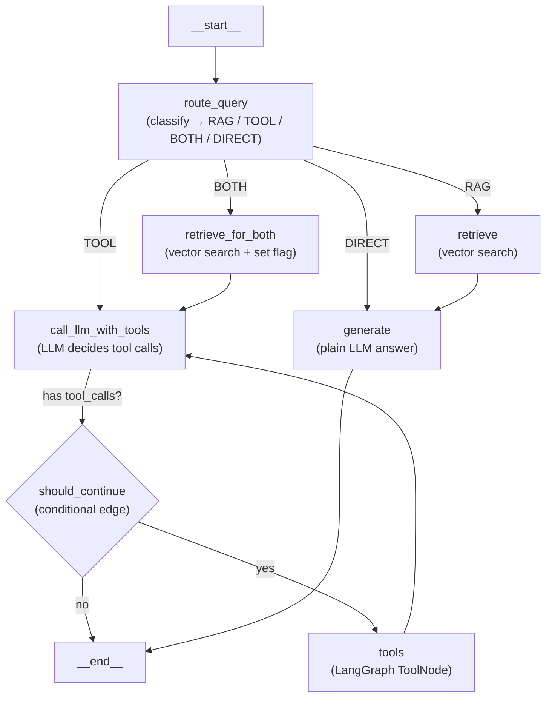

# Migrate ChatService from LangChain Chains → LangGraph StateGraph

## Background

The current codebase is a resume chatbot with 4 routes (**RAG**, **TOOL**, **BOTH**, **DIRECT**), all wired manually in [`chat.py`](file:///c:/Users/haris/Documents/Projects/Langgraph/Naive-RAG-LangChain/app/ai/chat.py). The routing, tool-calling loop, memory loading, and persistence are all hand-coded Python. We want to replace this with a clean **LangGraph `StateGraph`** so the flow is visible, the tool loop uses LangGraph's built-in `ToolNode`, and memory is managed by LangGraph's checkpointer — making the codebase simple and beginner-friendly.

### What changes (and what stays the same)

| Stays the same | Changes |
|---|---|
| [`router.py`](file:///c:/Users/haris/Documents/Projects/Langgraph/Naive-RAG-LangChain/app/ai/router.py) — the `QueryRouter` (reused as a node) | [`chat.py`](file:///c:/Users/haris/Documents/Projects/Langgraph/Naive-RAG-LangChain/app/ai/chat.py) — **rewritten** as a LangGraph graph |
| [`rag_pipeline.py`](file:///c:/Users/haris/Documents/Projects/Langgraph/Naive-RAG-LangChain/app/rag/rag_pipeline.py) — retrieval logic (called from a node) | [`memory/store.py`](file:///c:/Users/haris/Documents/Projects/Langgraph/Naive-RAG-LangChain/app/memory/store.py) — MongoDB persistence stays for conversation CRUD, but memory for the LLM is replaced by LangGraph checkpointer |
| [`tools/weather.py`](file:///c:/Users/haris/Documents/Projects/Langgraph/Naive-RAG-LangChain/app/tools/weather.py) — the `get_weather` tool | [`memory/window.py`](file:///c:/Users/haris/Documents/Projects/Langgraph/Naive-RAG-LangChain/app/memory/window.py) — **deleted** (window buffering replaced by checkpointer) |
| All prompts (unchanged) | [`routes/chatbot.py`](file:///c:/Users/haris/Documents/Projects/Langgraph/Naive-RAG-LangChain/app/routes/chatbot.py) — simplified (no more manual memory load) |
| [`chain.py`](file:///c:/Users/haris/Documents/Projects/Langgraph/Naive-RAG-LangChain/app/ai/chain.py) — unrelated 3-stage pipeline (untouched) | [`requirements.txt`](file:///c:/Users/haris/Documents/Projects/Langgraph/Naive-RAG-LangChain/app/../requirements.txt) — add `langgraph` |
| [`voice.py`](file:///c:/Users/haris/Documents/Projects/Langgraph/Naive-RAG-LangChain/app/ai/voice.py) — voice pipeline (untouched) | |

---

## The Graph — Visual Overview



> **Key idea for beginners:** Each box is a **node** (a Python function). The arrows are **edges**. The diamond is a **conditional edge** — it looks at the state and picks the next node. This is the *entire* flow of one chat message.

---

## Proposed Changes

### Dependencies

#### [MODIFY] [`requirements.txt`](file:///c:/Users/haris/Documents/Projects/Langgraph/Naive-RAG-LangChain/requirements.txt)

Add `langgraph` as a new dependency:

```diff
 langchain
 langsmith
+langgraph
```

---

### Core: The Graph (replaces ChatService)

#### [NEW] [`app/ai/graph.py`](file:///c:/Users/haris/Documents/Projects/Langgraph/Naive-RAG-LangChain/app/ai/graph.py)

This is the heart of the migration. A single, clean file that defines:

1. **`ChatState`** — a `TypedDict` that flows through the graph (LangGraph's state management)
2. **5 node functions** — each does one job
3. **2 conditional-edge functions** — the router decision, and the tool-loop check
4. **Graph assembly** — `StateGraph` → `add_node` → `add_edge` / `add_conditional_edges` → `compile`
5. **`MemorySaver`** checkpointer — replaces all of `memory/window.py`

```python
# ── State ──────────────────────────────────────────────────────
class ChatState(TypedDict):
    messages: Annotated[list, add_messages]   # LangGraph's built-in message reducer
    route: str                                 # "RAG" | "TOOL" | "BOTH" | "DIRECT"
    search_query: str                          # rewritten question from router
    context: str                               # retrieved RAG chunks (if any)

# ── Nodes ──────────────────────────────────────────────────────
async def route_query(state):     # calls QueryRouter, sets route + search_query
async def retrieve(state):        # calls rag_pipeline.retrieve, sets context
async def retrieve_for_both(state): # same retrieval, for the BOTH path
async def call_llm_with_tools(state): # invokes LLM with tools bound
async def generate(state):        # invokes plain LLM (RAG or DIRECT answer)

# ── Conditional edges ──────────────────────────────────────────
def pick_route(state) -> str:     # reads state["route"], returns node name
def should_continue(state) -> str: # checks last message for tool_calls

# ── Tool node ──────────────────────────────────────────────────
tools = ToolNode([get_weather])   # LangGraph's built-in — replaces _run_tool_loop

# ── Graph assembly ─────────────────────────────────────────────
graph = StateGraph(ChatState)
graph.add_node("route_query", route_query)
graph.add_node("retrieve", retrieve)
graph.add_node("retrieve_for_both", retrieve_for_both)
graph.add_node("call_llm_with_tools", call_llm_with_tools)
graph.add_node("generate", generate)
graph.add_node("tools", tools)

graph.add_edge(START, "route_query")
graph.add_conditional_edges("route_query", pick_route, {
    "RAG": "retrieve",
    "TOOL": "call_llm_with_tools",
    "BOTH": "retrieve_for_both",
    "DIRECT": "generate",
})
graph.add_edge("retrieve", "generate")
graph.add_edge("retrieve_for_both", "call_llm_with_tools")
graph.add_conditional_edges("call_llm_with_tools", should_continue, {
    "tools": "tools",
    "end": END,
})
graph.add_edge("tools", "call_llm_with_tools")
graph.add_edge("generate", END)

# ── Compile with memory ───────────────────────────────────────
checkpointer = MemorySaver()         # in-memory; swap to SqliteSaver for persistence
chat_graph = graph.compile(checkpointer=checkpointer)
```

> [!NOTE]
> **`MemorySaver`** automatically stores conversation history keyed by `thread_id`. This replaces the entire `memory/window.py` + the manual `load()` / `persist()` cycle. Each `thread_id` is our `conversation_id`.

> [!IMPORTANT]
> The `ToolNode` from `langgraph.prebuilt` replaces the hand-written `_run_tool_loop`. It automatically executes every tool the LLM asked for and appends `ToolMessage`s to state — no manual loop needed.

---

#### [MODIFY] [`app/ai/chat.py`](file:///c:/Users/haris/Documents/Projects/Langgraph/Naive-RAG-LangChain/app/ai/chat.py)

**Massively simplified.** The 533-line `ChatService` class is replaced by a thin wrapper that:
1. Invokes `chat_graph.astream()` with the user message
2. Yields tokens to the client
3. Persists the final answer to MongoDB (for the conversation list/history UI)

The `_build_models` / `warm_up_models` / `warm_up_llm` / `content_to_text` utilities remain here since the graph and voice module both use them.

```python
async def stream_chat(user_prompt: str, conversation_id: str, voice_mode: bool = False):
    """Invoke the LangGraph and stream tokens back."""
    config = {"configurable": {"thread_id": conversation_id}}
    
    input_messages = {"messages": [HumanMessage(content=user_prompt)]}
    
    async for event in chat_graph.astream_events(input_messages, config, version="v2"):
        # yield AI text tokens as they arrive
        if event["event"] == "on_chat_model_stream":
            token = content_to_text(event["data"]["chunk"].content)
            if token:
                yield token
```

---

### Memory: Simplification

#### [DELETE] [`app/memory/window.py`](file:///c:/Users/haris/Documents/Projects/Langgraph/Naive-RAG-LangChain/app/memory/window.py)

Entirely replaced by LangGraph's `MemorySaver` checkpointer. The window buffer, turn counting, and message ↔ LangChain-type conversion are no longer needed — `add_messages` in the state handles accumulation automatically.

#### [MODIFY] [`app/memory/store.py`](file:///c:/Users/haris/Documents/Projects/Langgraph/Naive-RAG-LangChain/app/memory/store.py)

**Kept as-is** for conversation CRUD (create, list, rename, delete, transcript for the UI). The `append_message` method is still called after streaming to persist the answer for the conversation list sidebar — but it is no longer the source of truth for the LLM's memory (checkpointer handles that).

---

### Route: Simplified Chatbot Endpoint

#### [MODIFY] [`app/routes/chatbot.py`](file:///c:/Users/haris/Documents/Projects/Langgraph/Naive-RAG-LangChain/app/routes/chatbot.py)

Simplified — no more manual memory loading:

```python
@router.post("/chatbot")
async def chatbot(body: ChatRequest, user_id: str = Depends(get_current_user_id)):
    # ... conversation creation / validation (unchanged) ...
    
    await conversation_store.append_message(conversation_id, "user", body.user_prompt)

    # No more: history = await window.load(conversation_id)
    # No more: service = ChatService(...)
    # Just stream the graph:
    return StreamingResponse(
        stream_chat(body.user_prompt, conversation_id),
        media_type="text/event-stream",
        headers={"X-Conversation-Id": conversation_id},
    )
```

---

### Startup

#### [MODIFY] [`app/main.py`](file:///c:/Users/haris/Documents/Projects/Langgraph/Naive-RAG-LangChain/app/main.py)

- Remove `from app.memory import window` imports (if any indirect usage)
- Keep `warm_up_models` / `warm_up_llm` calls — models are still cached the same way

---

## Open Questions

> [!IMPORTANT]
> **1. Checkpointer choice: `MemorySaver` vs `MongoDBSaver`?**
> 
> `MemorySaver` is in-memory — fast and zero-config, perfect for learning, but loses conversation state on server restart. Since you already have MongoDB, LangGraph also offers a MongoDB checkpointer (`langgraph-checkpoint-mongodb`) that would persist state across restarts. However, that adds a dependency and complexity.
> 
> **Recommendation:** Start with `MemorySaver` to keep it beginner-friendly. Your existing MongoDB `conversation_store` already persists messages for the UI. We can swap to `MongoDBSaver` later.

> [!IMPORTANT]
> **2. Voice mode integration?**
> 
> The voice pipeline ([`voice.py`](file:///c:/Users/haris/Documents/Projects/Langgraph/Naive-RAG-LangChain/app/ai/voice.py) + [`routes/voice.py`](file:///c:/Users/haris/Documents/Projects/Langgraph/Naive-RAG-LangChain/app/routes/voice.py)) currently imports `ChatService` from `chat.py`. Should we also wire voice mode through the LangGraph, or keep it using the old ChatService for now?
> 
> **Recommendation:** Keep voice mode on the old path initially to avoid breaking it. We can migrate it as a follow-up.

> [!IMPORTANT]
> **3. `chain.py` (3-stage concept pipeline) — migrate to LangGraph too?**
> 
> The [`ChainService`](file:///c:/Users/haris/Documents/Projects/Langgraph/Naive-RAG-LangChain/app/ai/chain.py) is an independent LCEL pipeline (extract → enrich → format). It's unrelated to the chat flow. Should we convert it to a LangGraph as well, or leave it as-is?
> 
> **Recommendation:** Leave it as-is — it's a clean, self-contained LCEL demo and migrating it adds no value to the learning goal.

---

## Verification Plan

### Automated Tests
```bash
# Install new dependency
pip install langgraph

# Start the server and verify it boots
python server.py

# Health check
curl http://localhost:8000/health
```

### Manual Verification
- Send a **DIRECT** query (e.g., "Hello!") → should get a streaming response
- Send a **RAG** query (e.g., "What are Harish's skills?") → should retrieve and answer
- Send a **TOOL** query (e.g., "What's the weather in Chennai?") → should call weather tool
- Send a **BOTH** query (e.g., "Is it raining where Harish works?") → should retrieve + call tool
- Send a **follow-up** (e.g., "Tell me more") → checkpointer should provide context from prior turns
- Verify the conversation list still shows correct history in the UI
