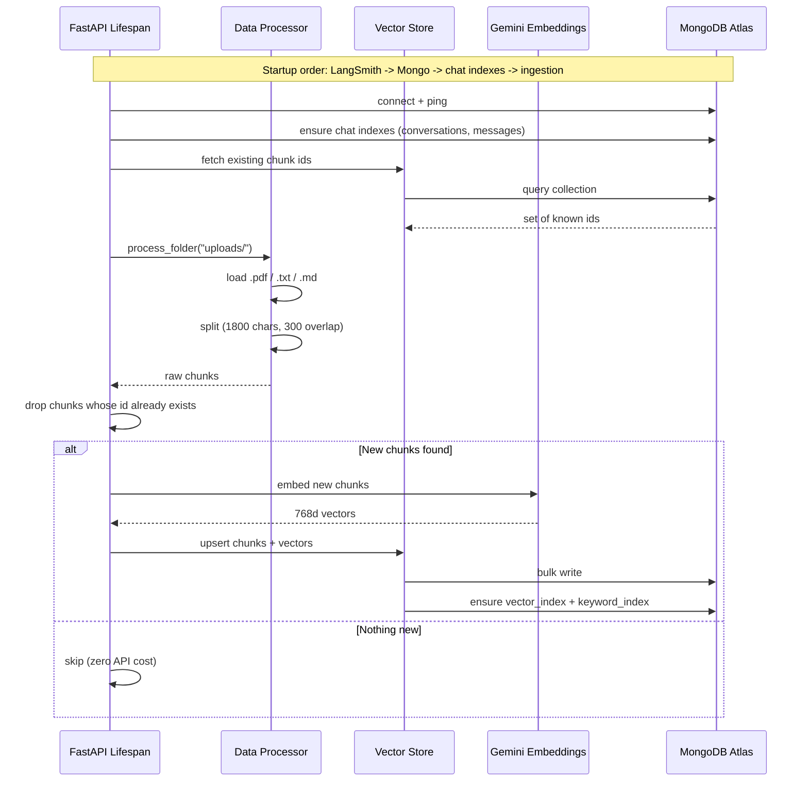
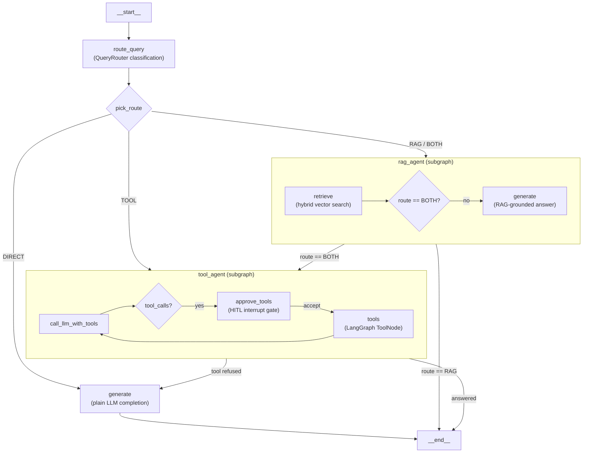
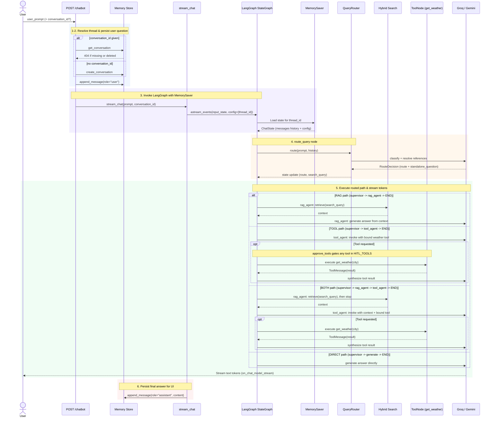
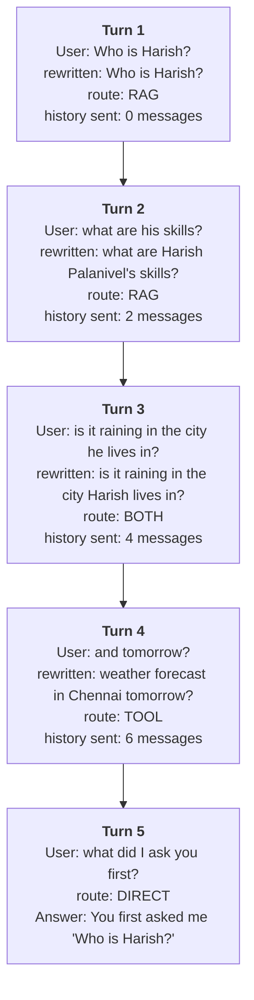
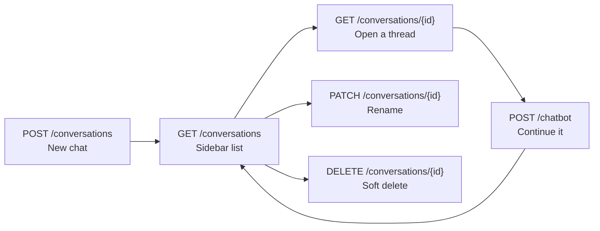

# Application Workflows

> **How to read this document.** Each section is one workflow, told as a story from start
> to finish. §2 is the one to read first — it is a single chat turn, step by step. §3
> follows one conversation across several turns and is where memory becomes visible.

Four workflows:

| # | Workflow | When it runs |
|---|---|---|
| 1 | Document ingestion | Once, at server startup |
| 2 | A single chat turn | Every `POST /chatbot` |
| 3 | A conversation over time | Across many turns |
| 4 | Conversation management | New chat, sidebar, rename, delete |

---

## 1. Document Ingestion

Runs automatically on server boot via FastAPI's `lifespan` handler. It scans `uploads/`,
processes new documents, and indexes them into MongoDB Atlas.

The important property is that it is **incremental**: each chunk gets a deterministic id,
existing ids are fetched first, and only genuinely new chunks are embedded. Restarting the
server ten times costs one embedding run, not ten.



---

## 2. A Single Chat Turn

This is the core workflow. A request arrives at `POST /chatbot`, carrying the session
cookie set at sign-in:

```json
{
  "conversation_id": "conv_9f8b2c1e-...",   // omit to start a new chat
  "user_prompt": "and where did he study?"
}
```

The body carries **no `user_id`**. The owner is resolved from the session cookie by
`get_current_user` before the handler runs, and a `user_id` sent in the body is ignored —
see [architecture.md](architecture.md) §12.7 for why accepting one was a real
vulnerability. An unauthenticated request never reaches step 1; it is rejected with 401.

### The Multi-Agent Execution Flow

Text chat turns (`POST /chatbot`) are executed via a **supervisor graph orchestrating specialist agent subgraphs** (`app/ai/agents/`, entered through `agents/graph.py`). The state history is automatically managed by the `MongoDBSaver` checkpointer using `thread_id = conversation_id`; because the agents are subgraphs compiled *without* checkpointers of their own, the parent's propagates down to all of them.

#### Supervisor Topology



Each agent owns a slice of the work: the **supervisor** routes and handles `DIRECT`, the **rag_agent** owns retrieval, and the **tool_agent** owns the toolbelt and the approval gate. `BOTH` is the only route that spans two agents, and the supervisor is what sequences it.

#### Sequence Diagram



### Step by step

| # | Step | Detail |
|---|---|---|
| 1 | **Resolve the thread** | Validates `conversation_id` or creates a new conversation thread. |
| 2 | **Save the question** | Appends the incoming user message to MongoDB Atlas prior to streaming. |
| 3 | **Invoke LangGraph** | `stream_chat` invokes `chat_graph.astream_events()` with `config={"configurable": {"thread_id": conversation_id}}`. |
| 4 | **Automatic Memory Loading** | The `MongoDBSaver` checkpointer loads past `ChatState.messages` for the specified `thread_id` — including the agents' state, since subgraphs share the parent's checkpointer. |
| 5 | **`route_query` Node** | Supervisor node. Calls `QueryRouter.route()` to classify query into `RAG`, `TOOL`, `BOTH`, or `DIRECT` and rewrite standalone query. Also resets the per-turn state (`context`, `denied_tools`). |
| 6 | **`pick_route` Conditional Edge** | Evaluates `state["route"]` to dispatch to the owning agent: `rag_agent` (RAG and BOTH), `tool_agent` (TOOL), or the supervisor's own `generate` (DIRECT). |
| 7 | **Agent Execution** | `rag_agent` fetches hybrid vector chunks, then answers (RAG) or stops so `tool_agent` can (BOTH). Inside `tool_agent`, `should_continue` routes tool calls through the `approve_tools` HITL gate into `ToolNode(TOOLS)`, which appends `ToolMessage`s automatically. A refused tool ends the agent with `denied_tools` set, and the supervisor falls back to `generate`. |
| 8 | **Token Streaming & Persistence** | Tokens emitted during `on_chat_model_stream` stream directly to client. Upon completion, assistant response is saved to MongoDB. |

> **Teaching note — the off-by-one in step 3.** The question is saved in step 2 and loaded
> back in step 3, so the newest stored message *is* the current question. `window.load()`
> drops that last message (`exclude_latest=True`), because the question is appended to the
> prompt explicitly at step 6. Without this the model would see it twice.

### What comes back

The body is a plain stream of text tokens. The thread id travels in a header:

```
X-Conversation-Id: conv_9f8b2c1e-4a77-4d1e-9c33-6b0f5d2a1e88
```

Read it on the first message of a new chat and send it back on every following message.

---

## 3. A Conversation Over Time

This is where memory earns its keep. Follow one real thread:



Notice what each turn demonstrates:

- **Turn 2** — `"his"` is resolved to a name, so the search actually finds something.
- **Turn 3** — the route switches to `BOTH`: the city has to be looked up in the resume
  *before* the weather tool can be called.
- **Turn 4** — `"and tomorrow?"` contains no subject and no place. Only history makes it
  answerable, and the route switches back to `TOOL`.
- **Turn 5** — proof the model really is being shown the earlier messages.

### How the window slides

With `WINDOW_K = 4`, history grows to 8 messages and then stops:

| After turn | Messages stored | Messages replayed |
|---|---|---|
| 1 | 2 | 0 |
| 2 | 4 | 2 |
| 3 | 6 | 4 |
| 4 | 8 | 6 |
| 5 | 10 | 8 |
| 6 | 12 | **8** (capped) |
| 20 | 40 | **8** |

Past 100 turns the window widens to 5 turns (10 messages) via `WINDOW_K_LARGE`.

> **Teaching note — the trade-off.** A window is cheap and predictable, but it *forgets*.
> Ask about something from turn 2 while on turn 40 and the model will not know it. The
> standard next step is a **rolling summary**: as messages fall out of the window,
> summarise them into a `summary` field on the conversation and prepend it to the prompt.
> That keeps long threads coherent without unbounded token growth.

---

## 4. Conversation Management

The endpoints behind a chat sidebar.



| Method | Path | Notes |
|---|---|---|
| `POST` | `/conversations` | Explicit new chat. Optional — posting to `/chatbot` without an id also creates one. |
| `GET` | `/conversations` | Sorted by `updated_at` descending. Supports `user_id`, `limit`, `skip`. |
| `GET` | `/conversations/{id}` | Full transcript, oldest first. Page backwards with `before_seq`. |
| `PATCH` | `/conversations/{id}` | Rename. |
| `DELETE` | `/conversations/{id}` | Soft delete — hidden from the sidebar, messages kept on disk. |

**Titles** are derived automatically from the first user message (trimmed to 60 characters),
so a thread names itself. A title supplied at creation, or set later via `PATCH`, is never
overwritten.

---

## 5. Trying it yourself

```bash
python server.py

# 1. Start a chat — the id comes back in the header
curl -N -D - -X POST http://127.0.0.1:8000/chatbot \
  -H 'Content-Type: application/json' \
  -d '{"user_prompt": "Who is Harish?"}'

# 2. Continue it — note the follow-up has no name in it
curl -N -X POST http://127.0.0.1:8000/chatbot \
  -H 'Content-Type: application/json' \
  -d '{"conversation_id": "conv_...", "user_prompt": "and where did he study?"}'

# 3. Read the thread back
curl http://127.0.0.1:8000/conversations/conv_...

# 4. See every thread
curl http://127.0.0.1:8000/conversations
```

Watch the server log while doing this — it prints the two lines that explain each turn:

```
Memory window for conv_...: 2 message(s) (k=4 turns, thread has ~1 turn(s))
Router selected: RAG for query: 'and where did he study?' (searching for: 'Where did Harish study?')
```

The first shows how much memory was replayed; the second shows the rewritten question that
was actually searched for. Between them they explain almost every surprising answer.
